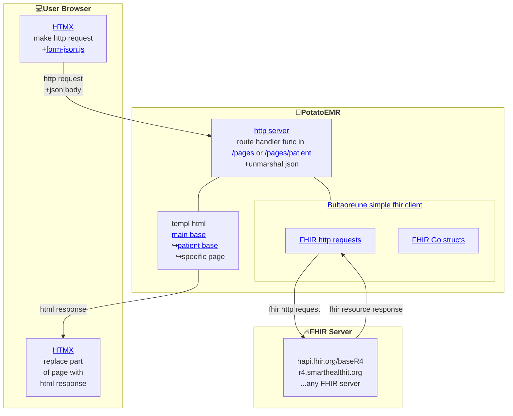

# [🥔PotatoEMR.com (click here try now)](https://potatoemr.com)

PotatoEMR is a simple(ish) EMR that stores data in a FHIR server. Try a demo online at [https://potatoemr.com](https://potatoemr.com).

### Quick Start

1. Download Go from [https://go.dev/dl/](https://go.dev/dl/)
2. Download [templ](https://templ.guide/)

    ```bash
    go install github.com/a-h/templ/cmd/templ@latest
    ```

3. Clone PotatoEMR and build

    ```bash
    git clone https://github.com/PotatoEMR/PotatoEMR.git
	cd PotatoEMR
	templ generate && go run .
	```
 4. Visit [http://127.0.0.1:8000/](http://127.0.0.1:8000/)

Note that you don't need templ to build/run the .go files, but you need templ to change any .templ file. You probably also want to install the templ extension for your IDE.

### Box Diagram/Table of Contents



Click links in the diagram to see where the code lives and how it works.

The user's browser and the FHIR server are sort of their own thing. HTMX makes http requests and replaces part of the page with the result, and form-json is an HTMX extension to submit forms as json. PotatoEMR itself mostly just renders html pages using templ. The fhir client library (Bultaeoreune) has FHIR resources as Go structs, CRUD operations, and some helper functions for rendering forms.

### Example 1: load patient allergy page

<pre>
User clicks link https://potatoemr.com/patient/1480486/allergies/
Browser sends GET request
	HTTP server receives request, matches mux.HandleFunc("GET /patient/{patId}/allergies/", pages_patient.Allergies)
		Fhir client sends to fhir server patEverything, err := Client.PatientEverythingGrouped(patId)
		Fhir client gets resources back in structs
	Func passes structs to templ to render html
	HTTP server sends html response back to browser
Browser inserts html response into page
</pre>

### Example 2: update an allergy

<pre>
User clicks link Update Allergy??
form-json converts request from key/value pairs to json body
Browser sends POST request REQ???
	HTTP server receives request, mux matches to handler func ???
	Handler func unmarshals json into AllergyIntolerance struct
	Handler func combines user's changes with existing allergy
		Fhir client sends update request to fhir server
		Fhir client sends patientEverything request to fhir server
		Fhir client gets resources back in structs
	Func passes structs to templ to render html
	HTTP server sends html response back to browser
Browser inserts html response into page
</pre>


Key differences are the browser sending the form as a json in request body to potatoemr, so we can easily unmarshal it into an r4.AllergyIntolerance, and the additional update request to fhir server. If you're familiar with fhir update, you might ask why the additional patientEverything on top of the update, because update already returns the updated resource. That could require oob swaps, which htmx can do but are tricker, vs simply getting all patient resources and updating the whole page like before. On the other hand, this makes an additional request to the fhir server and takes longer. One other step, handler func combines user's changes with existing allergy, is also not great; it exists only because fhir patch is much tricker than update, as there are two types of patch and what's supported varies by server, and "add each of my resource fields to the old resource, creating if they don't exist or updating if they do" in patch seems non trivial. But I would like to use patch if possible. And of course it is a lot of pieces so you might rightly ask why use a separate FHIR server. It makes some implementation and interoperability easier.
